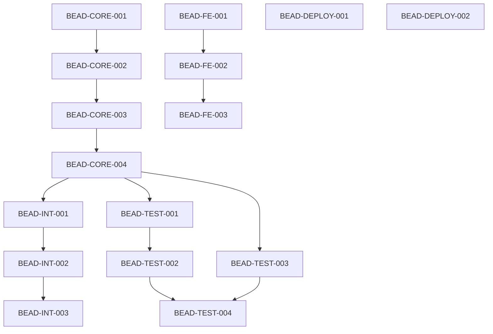

# AutoVoice Project Completion Prompt
## Ralph Loop Orchestration with Beads Tasks + Serena + Cipher

---

## 🎯 MISSION

Complete the AutoVoice GPU-accelerated singing voice conversion system from its current 75% state to 100% production-ready using:
- **Ralph Loop**: Orchestration pattern for iterative task execution
- **Beads Tasks**: Atomic, independently completable units of work
- **Serena MCP**: Code intelligence and project structure awareness
- **Cipher MCP**: Cross-session memory and context persistence

---

## 🧠 MCP SERVER ARCHITECTURE

```
┌─────────────────────────────────────────────────────────────────────┐
│                      RALPH LOOP ORCHESTRATOR                         │
│  ┌──────────────────────────────────────────────────────────────┐   │
│  │                    MCP SERVER LAYER                           │   │
│  │  ┌─────────────┐  ┌─────────────┐  ┌─────────────────────┐   │   │
│  │  │   SERENA    │  │   CIPHER    │  │   FILESYSTEM/GIT    │   │   │
│  │  │  (Code AI)  │  │  (Memory)   │  │    (Standard)       │   │   │
│  │  └──────┬──────┘  └──────┬──────┘  └──────────┬──────────┘   │   │
│  │         │                │                     │              │   │
│  │         ▼                ▼                     ▼              │   │
│  │  ┌─────────────────────────────────────────────────────────┐ │   │
│  │  │              UNIFIED CONTEXT ENGINE                      │ │   │
│  │  │  • Project structure (Serena)                           │ │   │
│  │  │  • Session memory (Cipher)                              │ │   │
│  │  │  • File operations (FS)                                 │ │   │
│  │  │  • Version control (Git)                                │ │   │
│  │  └─────────────────────────────────────────────────────────┘ │   │
│  └──────────────────────────────────────────────────────────────┘   │
│                                                                      │
│  ┌─────────┐   ┌─────────┐   ┌─────────┐   ┌─────────┐             │
│  │ REFLECT │ → │ ASSESS  │ → │  LOOP   │ → │ PERSIST │             │
│  │ +Cipher │   │ +Serena │   │ Execute │   │ +Cipher │             │
│  └─────────┘   └─────────┘   └─────────┘   └─────────┘             │
│       ↑                                          │                  │
│       └──────────────────────────────────────────┘                  │
└─────────────────────────────────────────────────────────────────────┘
```

---

## 🔧 MCP SERVER SETUP

### 1. Serena MCP Server (Code Intelligence)
```bash
# Install Serena
pip install serena-mcp

# Initialize Serena project for AutoVoice
serena init --project-root /home/kp/repos/autovoice \
            --name "autovoice" \
            --description "GPU-accelerated singing voice conversion"

# Or via Claude Code MCP config
# Add to ~/.config/claude/claude_desktop_config.json or .mcp.json:
```

```json
{
  "mcpServers": {
    "serena": {
      "command": "serena",
      "args": ["--project-root", "/home/kp/repos/autovoice"],
      "env": {
        "SERENA_PROJECT_NAME": "autovoice"
      }
    }
  }
}
```

**Serena Capabilities Used**:
- `serena_search_symbol` - Find functions, classes, variables
- `serena_get_file_structure` - Understand project layout
- `serena_find_references` - Track usage across codebase
- `serena_get_diagnostics` - Identify code issues
- `serena_apply_changes` - Batch code modifications

### 2. Cipher MCP Server (Session Memory)
```bash
# Cipher is already initialized at: data/cipher-sessions.db

# Add to MCP config if not present:
```

```json
{
  "mcpServers": {
    "cipher": {
      "command": "npx",
      "args": ["-y", "@anthropics/cipher-mcp"],
      "env": {
        "CIPHER_DB_PATH": "/home/kp/repos/autovoice/data/cipher-sessions.db"
      }
    }
  }
}
```

**Cipher Capabilities Used**:
- `cipher_store` - Save bead completion state, blockers, learnings
- `cipher_retrieve` - Recall context from previous sessions
- `cipher_search` - Find relevant past decisions
- `cipher_delete` - Clean up outdated context

---

## 🔄 RALPH LOOP ORCHESTRATION PATTERN

### Loop Stages (MCP-Enhanced):

1. **REFLECT** (+ Cipher):
   - `cipher_retrieve("autovoice_current_state")` - Load session context
   - `cipher_search("blockers")` - Check for known blockers
   - Read PROJECT_STATUS.md for bead progress

2. **ASSESS** (+ Serena):
   - `serena_get_file_structure()` - Understand current codebase state
   - `serena_get_diagnostics()` - Check for code issues
   - Select next bead from priority queue based on dependencies

3. **LOOP** (Execute):
   - `serena_search_symbol()` - Find relevant code locations
   - `serena_find_references()` - Understand impact of changes
   - Make atomic, focused changes for current bead
   - Run verification command

4. **PERSIST** (+ Cipher):
   - `cipher_store("bead_{id}_complete", {...})` - Save completion state
   - `cipher_store("learnings_{id}", {...})` - Save insights for future
   - Git commit with bead ID
   - Update PROJECT_STATUS.md

5. **REPEAT**: Return to REFLECT with updated context

---

## 📿 BEAD TASK DEFINITIONS

Each bead is an atomic, independently completable unit of work.

### BEAD SCHEMA
```yaml
bead:
  id: "BEAD-{PHASE}-{NUMBER}"
  name: "Short descriptive name"
  phase: "CORE|INTEGRATION|FRONTEND|TESTING|DEPLOYMENT"
  priority: "P0|P1|P2|P3"  # P0 = Critical blocker
  dependencies: ["BEAD-X-Y", ...]
  estimated_time: "15m|30m|1h|2h|4h"
  acceptance_criteria:
    - "Specific testable outcome 1"
    - "Specific testable outcome 2"
  files_to_modify: ["path/to/file.py", ...]
  verification_command: "pytest tests/test_x.py -v -k 'test_name'"
```

---

## 🎯 PHASE 1: CORE BLOCKERS (P0)

### BEAD-CORE-001: Fix PyTorch Environment
```yaml
id: BEAD-CORE-001
name: "Resolve PyTorch 3.13 Library Issue"
priority: P0
dependencies: []
estimated_time: 30m
acceptance_criteria:
  - "python -c 'import torch; print(torch.cuda.is_available())' returns True"
  - "torch.utils.cpp_extension imports without error"
  - "No libtorch_global_deps.so errors"
files_to_modify:
  - requirements.txt (if version change needed)
  - scripts/setup_pytorch_env.sh
verification_command: |
  python -c "import torch; assert torch.cuda.is_available(); print('✅ CUDA OK')"
```

### BEAD-CORE-002: Build CUDA Extensions
```yaml
id: BEAD-CORE-002
name: "Compile CUDA Kernels with pybind11"
priority: P0
dependencies: [BEAD-CORE-001]
estimated_time: 30m
acceptance_criteria:
  - "python setup.py build_ext --inplace completes without errors"
  - "import cuda_kernels succeeds"
  - "cuda_kernels.launch_pitch_detection is callable"
files_to_modify:
  - setup.py (if build config needed)
  - src/cuda_kernels/bindings.cpp
verification_command: |
  python -c "import cuda_kernels; print(dir(cuda_kernels)); print('✅ Bindings OK')"
```

### BEAD-CORE-003: CUDA Kernel Smoke Tests
```yaml
id: BEAD-CORE-003
name: "Validate CUDA Kernel Bindings"
priority: P0
dependencies: [BEAD-CORE-002]
estimated_time: 1h
acceptance_criteria:
  - "All 4 smoke test sections pass"
  - "Pitch detection returns valid F0 array"
  - "Vibrato analysis returns depth/rate values"
  - "No CUDA memory errors"
files_to_modify:
  - tests/test_bindings_smoke.py (if fixes needed)
verification_command: "pytest tests/test_bindings_smoke.py -v"
```

### BEAD-CORE-004: Core Test Suite Execution
```yaml
id: BEAD-CORE-004
name: "Run Full pytest Suite"
priority: P0
dependencies: [BEAD-CORE-003]
estimated_time: 2h
acceptance_criteria:
  - "90%+ tests pass (allow known skips)"
  - "No unexpected failures in audio, models, inference"
  - "Coverage report generated"
files_to_modify:
  - Any failing test files
  - src/ files with bugs exposed by tests
verification_command: "pytest tests/ -v --cov=src/auto_voice --cov-report=html"
```

---

## 🎯 PHASE 2: INTEGRATION (P1)

### BEAD-INT-001: Docker Image Build
```yaml
id: BEAD-INT-001
name: "Build and Validate Docker Image"
priority: P1
dependencies: [BEAD-CORE-004]
estimated_time: 1h
acceptance_criteria:
  - "docker build -t autovoice:test . succeeds"
  - "Image size under 8GB"
  - "No security vulnerabilities in base layers"
files_to_modify:
  - Dockerfile
  - .dockerignore
verification_command: "docker build -t autovoice:test . && docker images autovoice:test"
```

### BEAD-INT-002: Container Runtime Test
```yaml
id: BEAD-INT-002
name: "Validate Container Runs with GPU"
priority: P1
dependencies: [BEAD-INT-001]
estimated_time: 30m
acceptance_criteria:
  - "Container starts without errors"
  - "GPU accessible inside container"
  - "Health endpoint responds 200"
  - "No CUDA driver mismatch"
files_to_modify:
  - docker-compose.yml (if GPU config needed)
verification_command: |
  docker run --gpus all -d -p 5000:5000 autovoice:test && \
  sleep 10 && curl -f http://localhost:5000/health
```

### BEAD-INT-003: Docker Compose Stack
```yaml
id: BEAD-INT-003
name: "Validate Full Stack with Monitoring"
priority: P1
dependencies: [BEAD-INT-002]
estimated_time: 1h
acceptance_criteria:
  - "All services start (app, prometheus, grafana)"
  - "Prometheus scrapes metrics"
  - "Grafana dashboards load"
  - "No container restarts"
files_to_modify:
  - docker-compose.yml
  - config/prometheus.yml
verification_command: "docker-compose --profile monitoring up -d && docker-compose ps"
```

### BEAD-INT-004: API Integration Tests
```yaml
id: BEAD-INT-004
name: "Validate All REST API Endpoints"
priority: P1
dependencies: [BEAD-INT-002]
estimated_time: 1h
acceptance_criteria:
  - "GET /health returns 200"
  - "POST /api/v1/voice/clone accepts audio"
  - "POST /api/v1/convert/song returns job_id"
  - "GET /api/v1/convert/status/{id} tracks progress"
  - "WebSocket connection established"
files_to_modify:
  - src/auto_voice/web/api.py
  - tests/test_api_e2e_validation.py
verification_command: "pytest tests/test_api_e2e_validation.py -v"
```

### BEAD-INT-005: WebSocket Real-time Test
```yaml
id: BEAD-INT-005
name: "Validate WebSocket Progress Events"
priority: P1
dependencies: [BEAD-INT-004]
estimated_time: 30m
acceptance_criteria:
  - "WebSocket connects successfully"
  - "Progress events received during conversion"
  - "Completion event fires with result"
  - "Error events properly formatted"
files_to_modify:
  - src/auto_voice/web/websocket_handler.py
  - scripts/test_websocket_connection.py
verification_command: "python scripts/test_websocket_connection.py"
```

---

## 🎯 PHASE 3: FRONTEND (P1)

### BEAD-FE-001: Frontend Build Validation
```yaml
id: BEAD-FE-001
name: "Ensure Frontend Builds Successfully"
priority: P1
dependencies: []
estimated_time: 15m
acceptance_criteria:
  - "npm install completes without errors"
  - "npm run build produces dist/ folder"
  - "No TypeScript errors"
  - "No ESLint errors"
files_to_modify:
  - frontend/package.json
  - frontend/tsconfig.json
verification_command: "cd frontend && npm install && npm run build"
```

### BEAD-FE-002: Voice Profile Upload Flow
```yaml
id: BEAD-FE-002
name: "Complete Voice Profile Creation UI"
priority: P1
dependencies: [BEAD-FE-001]
estimated_time: 2h
acceptance_criteria:
  - "Drag-and-drop audio upload works"
  - "Upload progress displayed"
  - "Profile preview with waveform"
  - "Success/error feedback shown"
files_to_modify:
  - frontend/src/pages/VoiceProfilesPage.tsx
  - frontend/src/components/VoiceProfileSelector.tsx
  - frontend/src/services/api.ts
verification_command: "cd frontend && npm run dev"
```

### BEAD-FE-003: Song Conversion Flow
```yaml
id: BEAD-FE-003
name: "Complete Singing Conversion UI"
priority: P1
dependencies: [BEAD-FE-002]
estimated_time: 2h
acceptance_criteria:
  - "Song upload with format validation"
  - "Voice profile selection works"
  - "Quality preset selector functional"
  - "Real-time progress via WebSocket"
  - "Result playback and download"
files_to_modify:
  - frontend/src/pages/SingingConversionPage.tsx
  - frontend/src/components/SingingConversion/*.tsx
  - frontend/src/services/websocket.ts
verification_command: "cd frontend && npm run dev"
```

### BEAD-FE-004: A/B Comparison Component
```yaml
id: BEAD-FE-004
name: "Implement Before/After Audio Comparison"
priority: P2
dependencies: [BEAD-FE-003]
estimated_time: 1h
acceptance_criteria:
  - "Side-by-side waveform display"
  - "Synced playback controls"
  - "Toggle between original and converted"
  - "Quality metrics display"
files_to_modify:
  - frontend/src/components/ABComparison.tsx
  - frontend/src/components/AudioWaveform.tsx
verification_command: "cd frontend && npm run build"
```

### BEAD-FE-005: System Status Dashboard
```yaml
id: BEAD-FE-005
name: "Complete GPU/System Monitoring UI"
priority: P2
dependencies: [BEAD-FE-001]
estimated_time: 1h
acceptance_criteria:
  - "GPU utilization chart updates live"
  - "Memory usage displayed"
  - "Active jobs list with progress"
  - "Error log viewer"
files_to_modify:
  - frontend/src/pages/SystemStatusPage.tsx
  - frontend/src/components/GPUMonitor.tsx
verification_command: "cd frontend && npm run build"
```

---

## 🎯 PHASE 4: TESTING (P1)

### BEAD-TEST-001: Fix Skipped Model Tests
```yaml
id: BEAD-TEST-001
name: "Enable and Pass Model Tests"
priority: P1
dependencies: [BEAD-CORE-004]
estimated_time: 2h
acceptance_criteria:
  - "test_models.py passes 90%+ tests"
  - "VoiceTransformer tests pass"
  - "HiFiGAN tests pass"
  - "Speaker encoder tests pass"
files_to_modify:
  - tests/test_models.py
  - src/auto_voice/models/*.py
verification_command: "pytest tests/test_models.py -v"
```

### BEAD-TEST-002: Fix Skipped Inference Tests
```yaml
id: BEAD-TEST-002
name: "Enable and Pass Inference Tests"
priority: P1
dependencies: [BEAD-TEST-001]
estimated_time: 2h
acceptance_criteria:
  - "test_inference.py passes 90%+ tests"
  - "Voice conversion pipeline tests pass"
  - "Singing conversion tests pass"
  - "TensorRT fallback tests pass"
files_to_modify:
  - tests/test_inference.py
  - src/auto_voice/inference/*.py
verification_command: "pytest tests/test_inference.py -v"
```

### BEAD-TEST-003: Fix Skipped Audio Tests
```yaml
id: BEAD-TEST-003
name: "Enable and Pass Audio Processing Tests"
priority: P1
dependencies: [BEAD-CORE-004]
estimated_time: 1h
acceptance_criteria:
  - "test_audio_processor.py passes 90%+"
  - "Mel spectrogram tests pass"
  - "Pitch extraction tests pass"
  - "Source separation tests pass"
files_to_modify:
  - tests/test_audio_processor.py
  - src/auto_voice/audio/*.py
verification_command: "pytest tests/test_audio_processor.py -v"
```

### BEAD-TEST-004: End-to-End Conversion Test
```yaml
id: BEAD-TEST-004
name: "Full Pipeline E2E Validation"
priority: P1
dependencies: [BEAD-TEST-002, BEAD-TEST-003]
estimated_time: 2h
acceptance_criteria:
  - "Can create voice profile from audio"
  - "Can convert song to target voice"
  - "Output audio plays correctly"
  - "Pitch accuracy within 5 cents"
  - "Speaker similarity > 0.85"
files_to_modify:
  - tests/test_end_to_end.py
  - tests/test_singing_conversion.py
verification_command: "pytest tests/test_end_to_end.py tests/test_singing_conversion.py -v"
```

### BEAD-TEST-005: Performance Benchmarks
```yaml
id: BEAD-TEST-005
name: "Establish Performance Baselines"
priority: P2
dependencies: [BEAD-TEST-004]
estimated_time: 1h
acceptance_criteria:
  - "Conversion latency documented (P50, P95, P99)"
  - "GPU memory usage profiled"
  - "Throughput measured (songs/hour)"
  - "Results saved to validation_results/"
files_to_modify:
  - tests/test_performance.py
  - tests/benchmark_performance.py
verification_command: "pytest tests/test_performance.py -v --benchmark-json=benchmarks.json"
```

---

## 🎯 PHASE 5: DEPLOYMENT (P2)

### BEAD-DEPLOY-001: Model Download Script
```yaml
id: BEAD-DEPLOY-001
name: "Automate Pretrained Model Downloads"
priority: P1
dependencies: []
estimated_time: 1h
acceptance_criteria:
  - "Script downloads all required models"
  - "Verifies checksums"
  - "Models placed in correct directories"
  - "Handles network failures gracefully"
files_to_modify:
  - scripts/download_pretrained_models.py
  - config/pretrained_models.yaml
verification_command: "python scripts/download_pretrained_models.py --verify"
```

### BEAD-DEPLOY-002: Production Config Validation
```yaml
id: BEAD-DEPLOY-002
name: "Validate All Config Files"
priority: P1
dependencies: []
estimated_time: 30m
acceptance_criteria:
  - "All YAML configs parse correctly"
  - "Environment variable overrides work"
  - "No hardcoded paths remain"
  - "Secrets not committed"
files_to_modify:
  - config/*.yaml
  - src/auto_voice/utils/config_loader.py
verification_command: "python -c 'from auto_voice.utils.config_loader import load_config; print(load_config())'"
```

### BEAD-DEPLOY-003: Kubernetes Manifests
```yaml
id: BEAD-DEPLOY-003
name: "Create K8s Deployment Configs"
priority: P2
dependencies: [BEAD-INT-003]
estimated_time: 2h
acceptance_criteria:
  - "k8s/ directory with manifests"
  - "Deployment, Service, ConfigMap created"
  - "GPU node selector configured"
  - "Resource limits defined"
  - "Liveness/readiness probes set"
files_to_modify:
  - k8s/deployment.yaml (new)
  - k8s/service.yaml (new)
  - k8s/configmap.yaml (new)
verification_command: "kubectl apply -f k8s/ --dry-run=client"
```

### BEAD-DEPLOY-004: CI/CD Pipeline Fixes
```yaml
id: BEAD-DEPLOY-004
name: "Fix GitHub Actions Workflows"
priority: P1
dependencies: [BEAD-CORE-004]
estimated_time: 1h
acceptance_criteria:
  - "CI workflow runs without errors"
  - "Tests execute in CI"
  - "Docker build works in CI"
  - "Artifacts uploaded correctly"
files_to_modify:
  - .github/workflows/ci.yml
  - .github/workflows/docker-build.yml
verification_command: "gh workflow run ci.yml --ref main"
```

### BEAD-DEPLOY-005: Security Hardening
```yaml
id: BEAD-DEPLOY-005
name: "Security Scan and Fixes"
priority: P2
dependencies: [BEAD-INT-001]
estimated_time: 1h
acceptance_criteria:
  - "No critical vulnerabilities in deps"
  - "No secrets in codebase"
  - "Input validation complete"
  - "Rate limiting configured"
files_to_modify:
  - requirements.txt
  - src/auto_voice/web/api.py
verification_command: "pip-audit && gitleaks detect"
```

---

## 🔄 RALPH LOOP EXECUTION PROTOCOL (MCP-Enhanced)

### Before Each Bead
```python
def before_bead(bead_id):
    """Pre-execution checklist with MCP integration"""

    # 1. CIPHER: Load session context
    context = cipher_retrieve("autovoice_session_state")
    blockers = cipher_search("blocker OR issue OR failed")

    # 2. SERENA: Analyze project state
    diagnostics = serena_get_diagnostics()
    structure = serena_get_file_structure("src/auto_voice")

    # 3. Check dependencies from previous beads
    for dep in bead.dependencies:
        if not cipher_retrieve(f"bead_{dep}_complete"):
            raise DependencyNotMet(f"{dep} must complete first")

    # 4. Create git branch
    git_checkout(f"bead/{bead_id}")

    # 5. Store start state in Cipher
    cipher_store(f"bead_{bead_id}_started", {
        "timestamp": now(),
        "diagnostics_count": len(diagnostics),
        "files_to_modify": bead.files_to_modify
    })
```

### During Bead Execution
```python
def execute_bead(bead):
    """Atomic task execution with Serena code intelligence"""

    # 1. SERENA: Find relevant code locations
    for file in bead.files_to_modify:
        symbols = serena_search_symbol(file, bead.target_symbols)
        references = serena_find_references(symbols)

    # 2. Focus ONLY on this bead's scope
    # 3. Make minimal, targeted changes
    # 4. Run verification_command after each change

    result = run_command(bead.verification_command)

    # 5. If blocked, store in Cipher and skip
    if result.failed:
        cipher_store(f"bead_{bead.id}_blocker", {
            "error": result.error,
            "suggestion": analyze_error(result.error)
        })
        return BLOCKED

    return SUCCESS
```

### After Each Bead
```python
def after_bead(bead_id, success):
    """Post-execution persistence with Cipher memory"""

    # 1. Run final verification
    result = run_command(bead.verification_command)

    # 2. CIPHER: Store completion state
    if success:
        cipher_store(f"bead_{bead_id}_complete", {
            "timestamp": now(),
            "duration": elapsed,
            "files_modified": git_diff_files(),
            "verification_passed": True
        })

        # Store learnings for future sessions
        cipher_store(f"learnings_{bead_id}", {
            "challenges": challenges_encountered,
            "solutions": solutions_applied,
            "tips": tips_for_similar_tasks
        })

        # Git commit
        git_commit(f"✅ {bead_id}: {bead.name}")

    else:
        cipher_store(f"bead_{bead_id}_failed", {
            "timestamp": now(),
            "error": result.error,
            "attempted_fixes": attempted_fixes,
            "needs_human": needs_human_intervention
        })
        git_stash()  # Save work for later

    # 3. Update PROJECT_STATUS.md
    update_status_file(bead_id, success)

    # 4. Return to REFLECT stage
    return REFLECT
```

---

## 📊 PROGRESS TRACKING (Cipher-Backed)

### Cipher Session Keys
```python
# Session state keys stored in Cipher
CIPHER_KEYS = {
    "autovoice_session_state": "Current session context",
    "bead_{id}_started": "Bead start timestamp and context",
    "bead_{id}_complete": "Bead completion with details",
    "bead_{id}_failed": "Bead failure with error details",
    "bead_{id}_blocker": "Blocker information",
    "learnings_{id}": "Insights from completing bead",
    "project_decisions": "Key architectural decisions made",
    "known_issues": "Issues to watch for across sessions"
}
```

### Initialize Cipher Session
```bash
# At session start, store initial state
cipher_store("autovoice_session_state", {
    "project": "autovoice",
    "goal": "Complete to 100% production-ready",
    "current_phase": "CORE",
    "beads_total": 24,
    "beads_complete": 0,
    "session_started": "2025-01-07T10:00:00Z"
})
```

### Status File: PROJECT_STATUS.md
```markdown
# AutoVoice Completion Status

## Current Phase: [PHASE_NAME]
## Active Bead: [BEAD_ID]
## Overall Progress: [X]% (Y/Z beads)
## Cipher Session: autovoice_session_state

### Completed Beads
- [x] BEAD-CORE-001: Fix PyTorch Environment ✅
- [x] BEAD-CORE-002: Build CUDA Extensions ✅
...

### In Progress
- [ ] BEAD-INT-001: Docker Image Build 🔄

### Blocked
- [ ] BEAD-DEPLOY-003: Kubernetes Manifests ⚠️
  - Blocker: Waiting for BEAD-INT-003

### Remaining
- [ ] BEAD-TEST-005: Performance Benchmarks
...
```

---

## 🎯 EXECUTION ORDER (Critical Path)



### Priority Order
1. **P0 Critical Path**: CORE-001 → CORE-002 → CORE-003 → CORE-004
2. **P1 Integration**: INT-001 → INT-002 → INT-003 → INT-004 → INT-005
3. **P1 Frontend** (parallel): FE-001 → FE-002 → FE-003
4. **P1 Testing** (parallel): TEST-001 → TEST-002, TEST-003 → TEST-004
5. **P2 Deployment**: DEPLOY-001, DEPLOY-002 → DEPLOY-003 → DEPLOY-004 → DEPLOY-005

---

## 🚀 QUICK START

### Initialize Ralph Loop
### Step 1: Initialize MCP Servers
```bash
# Install Serena MCP Server
pip install serena-mcp

# Initialize Serena project
serena init --project-root /home/kp/repos/autovoice \
            --name "autovoice" \
            --lang "python" \
            --framework "pytorch,flask"

# Verify Cipher database exists (already present)
ls -la data/cipher-sessions.db

# Add MCP config (create if not exists)
cat > .mcp.json << 'EOF'
{
  "mcpServers": {
    "serena": {
      "command": "serena",
      "args": ["--project-root", "/home/kp/repos/autovoice"],
      "env": {"SERENA_PROJECT_NAME": "autovoice"}
    },
    "cipher": {
      "command": "npx",
      "args": ["-y", "@anthropics/cipher-mcp"],
      "env": {"CIPHER_DB_PATH": "/home/kp/repos/autovoice/data/cipher-sessions.db"}
    }
  }
}
EOF
```

### Step 2: Initialize Cipher Session
```bash
# Store initial session state (via Claude/MCP)
# This happens automatically when Claude starts with Cipher enabled

# Manual initialization script (optional):
cat > scripts/init_cipher_session.py << 'EOF'
"""Initialize Cipher session for AutoVoice completion"""
import json
from datetime import datetime

INITIAL_STATE = {
    "project": "autovoice",
    "goal": "Complete to 100% production-ready",
    "current_phase": "CORE",
    "beads_total": 24,
    "beads_complete": 0,
    "session_started": datetime.utcnow().isoformat() + "Z",
    "critical_blockers": [],
    "completed_beads": []
}

print(json.dumps(INITIAL_STATE, indent=2))
# Use: cipher_store("autovoice_session_state", INITIAL_STATE)
EOF
```

### Step 3: Create Status Tracking
```bash
cat > PROJECT_STATUS.md << 'EOF'
# AutoVoice Completion Status

## Current Phase: CORE
## Active Bead: BEAD-CORE-001
## Overall Progress: 0% (0/24 beads)
## MCP Servers: Serena ✅ | Cipher ✅

### Session Context (Cipher)
- Session Key: `autovoice_session_state`
- Learnings Key: `learnings_{bead_id}`
- Blockers Key: `known_issues`

### Completed Beads
(none yet)

### In Progress
- [ ] BEAD-CORE-001: Fix PyTorch Environment 🔄

### Blocked
(none yet)
EOF
```

### Step 4: Start First Bead
```bash
# Create branch
git checkout -b bead/BEAD-CORE-001

# Execute (with Serena context awareness)
# Serena will index the project structure automatically

# Fix environment
conda create -n autovoice-py312 python=3.12
conda activate autovoice-py312
pip install -r requirements.txt

# Verify
python -c "import torch; assert torch.cuda.is_available()"

# Complete and store in Cipher
git add . && git commit -m "✅ BEAD-CORE-001: Fix PyTorch Environment"

# Cipher stores completion automatically via MCP
```

---

## 📈 SUCCESS METRICS

### Completion Criteria
| Metric | Target | Current |
|--------|--------|---------|
| Beads Completed | 24/24 | 0/24 |
| Test Pass Rate | >90% | ~75% |
| Code Coverage | >85% | ~80% |
| Docker Build | ✅ Pass | ❌ Untested |
| E2E Conversion | ✅ Works | ❌ Untested |
| Frontend Build | ✅ Pass | ❌ Untested |

### Definition of Done
- [ ] All P0 beads completed (4/4)
- [ ] All P1 beads completed (15/15)
- [ ] All P2 beads completed (5/5)
- [ ] Full test suite passing
- [ ] Docker deployment validated
- [ ] Frontend connected to backend
- [ ] One successful song conversion demo

---

## ⚠️ CONSTRAINTS

### DO
- Execute one bead at a time
- Verify before marking complete
- Document blockers immediately
- Keep commits atomic and descriptive
- Test after every change

### DON'T
- Skip dependency beads
- Make changes outside bead scope
- Commit broken code
- Ignore failing tests
- Batch multiple beads together

---

## 📚 REFERENCE FILES

### Project Documentation
- `docs/completion_roadmap.md` - Full gap analysis
- `docs/skipped_tests_implementation_map.md` - Test fix priorities
- `CLAUDE.md` - Project structure and commands
- `pytest.ini` - Test markers and config
- `run_tests.sh` - Test execution shortcuts

### MCP Configuration
- `.mcp.json` - MCP server configuration (create if missing)
- `data/cipher-sessions.db` - Cipher memory database
- `.serena/` - Serena project index (auto-generated)

---

## 🔮 SERENA USAGE EXAMPLES

```python
# Find all voice conversion related code
serena_search_symbol("convert", file_pattern="*.py")

# Get project structure for planning
serena_get_file_structure("src/auto_voice")

# Find all usages of a function before modifying
serena_find_references("SingingConversionPipeline.convert_song")

# Check for issues after changes
serena_get_diagnostics(severity="error")

# Apply batch changes safely
serena_apply_changes([
    {"file": "src/x.py", "old": "...", "new": "..."},
    {"file": "src/y.py", "old": "...", "new": "..."}
])
```

---

## 💾 CIPHER USAGE EXAMPLES

```python
# Store bead completion
cipher_store("bead_CORE_001_complete", {
    "timestamp": "2025-01-07T10:30:00Z",
    "success": True,
    "files_modified": ["requirements.txt"],
    "verification": "torch.cuda.is_available() == True"
})

# Retrieve session state at start of new session
state = cipher_retrieve("autovoice_session_state")
print(f"Resuming: {state['beads_complete']}/{state['beads_total']} complete")

# Search for relevant learnings
learnings = cipher_search("PyTorch CUDA installation")
# Returns past solutions for similar issues

# Store architectural decision
cipher_store("project_decisions", {
    "decision": "Use Python 3.12 instead of 3.13",
    "reason": "PyTorch CUDA compatibility",
    "date": "2025-01-07",
    "bead": "CORE-001"
})

# Track known issues across sessions
cipher_store("known_issues", [
    {"issue": "TensorRT requires specific CUDA version", "workaround": "..."},
    {"issue": "Demucs OOM on songs > 5min", "workaround": "chunk processing"}
])
```

---

## 🔁 SESSION RESUMPTION PROTOCOL

When starting a new Claude Code session:

```python
# 1. Load Cipher context
state = cipher_retrieve("autovoice_session_state")
blockers = cipher_retrieve("known_issues")
last_bead = cipher_search("bead_*_complete", sort="timestamp", limit=1)

# 2. Check Serena project state
diagnostics = serena_get_diagnostics()
structure = serena_get_file_structure()

# 3. Determine next bead
if last_bead:
    next_bead = get_next_bead_after(last_bead.id)
else:
    next_bead = "BEAD-CORE-001"

# 4. Resume Ralph Loop
print(f"Resuming from {next_bead}")
print(f"Progress: {state['beads_complete']}/{state['beads_total']}")
print(f"Known blockers: {len(blockers)}")

# 5. Continue execution
execute_ralph_loop(starting_bead=next_bead)
```

---

## 🎯 AGENT PROMPT (Copy This)

```
You are completing the AutoVoice project using Ralph Loop orchestration.

MCP SERVERS ACTIVE:
- Serena: Code intelligence at /home/kp/repos/autovoice
- Cipher: Session memory at data/cipher-sessions.db

PROTOCOL:
1. REFLECT: cipher_retrieve("autovoice_session_state")
2. ASSESS: serena_get_diagnostics() + select next bead
3. LOOP: Execute bead with serena_* for code ops
4. PERSIST: cipher_store() completion + git commit
5. REPEAT

CURRENT TASK: Check Cipher for last completed bead, then execute next.

START: Run cipher_retrieve("autovoice_session_state") to get current state.
```

---

**Generated**: 2025-01-07
**Estimated Total Time**: 25-35 hours
**Beads Count**: 24 atomic tasks
**MCP Servers**: Serena (Code) + Cipher (Memory)
**Orchestration**: Ralph Loop Pattern

