# Phase 4 Implementation Plan: Security Hardening and Documentation Enhancement

## Executive Summary

**Phase 4 Goals**: Security hardening through automated dependency updates and enhanced documentation for PyTorch/CUDA troubleshooting.

**Current State**: Most requested tasks already complete - only 2 primary implementations and 1 optional enhancement needed.

**Estimated Effort**: 1-2 hours
**Success Criteria**: Dependabot configured, runbook expanded with PyTorch troubleshooting, documentation quality high
**Risk Level**: Low (minimal changes, no existing functionality impacted)

## Executive Summary (lines 1-30)
- Title: "Phase 4 Implementation Plan: Security Hardening and Documentation Enhancement"
- Current state assessment: Most tasks already complete
- Actual work required: 2 primary tasks, 1 optional enhancement
- Estimated effort: 1-2 hours
- Expected outcome: Dependabot configured, runbook enhanced

## Current State Analysis (lines 31-80)
- **Already Complete** section:
  - Dockerfile CUDA version: ✅ Already 12.1.0 (line 3)
  - Trivy security scanner: ✅ Already implemented (docker-build.yml lines 87-112)
  - README.md compatibility matrix: ✅ Already comprehensive (lines 11-20)
  - README.md driver requirements: ✅ Already documented (lines 636-655)
  - README.md troubleshooting: ✅ Comprehensive (lines 634-790)
- **Missing Components** section:
  - Dependabot configuration: ❌ Not found
  - PyTorch-specific troubleshooting in runbook: ⚠️ Needs expansion

## Task Breakdown (lines 81-150)
- **Task 1: Create Dependabot Configuration** (Priority: P1, Effort: 30 minutes)
  - File: `.github/dependabot.yml`
  - Purpose: Automated dependency updates for security patches
  - Scope: Python pip dependencies, GitHub Actions, Docker base images
- **Task 2: Expand Runbook with PyTorch/CUDA Troubleshooting** (Priority: P1, Effort: 45 minutes)
  - File: `docs/runbook.md`
  - Purpose: Document PyTorch-specific issues encountered in project
  - Scope: Python 3.13 compatibility, libtorch errors, segmentation faults, environment setup
- **Task 3: Enhance README.md Compatibility Matrix** (Priority: P3, Effort: 15 minutes, Optional)
  - File: `README.md`
  - Purpose: Add PyTorch version compatibility details
  - Scope: Minor enhancement to existing comprehensive matrix

## Implementation Details (lines 151-250)
- Detailed specifications for each task
- Reference files and line numbers
- Expected content structure
- Validation criteria

## Validation Checklist (lines 251-280)
- Dependabot configuration validates successfully
- Runbook troubleshooting section is comprehensive
- README enhancements accurate
- All documentation up-to-date
- No broken links or references

## Success Criteria (lines 281-300)
- Dependabot creates first PR within 24 hours
- Runbook addresses all PyTorch issues from project history
- Documentation clear and actionable
- Phase 4 marked complete

## Mermaid Diagram

```mermaid
sequenceDiagram
    participant User
    participant Assessment as Current State Assessment
    participant Task1 as Create Dependabot Config
    participant Task2 as Expand Runbook
    participant Task3 as Enhance README (Optional)
    participant Validation
    participant Report as Generate Report

    User->>Assessment: Review Phase 4 requirements
    Assessment->>Assessment: Check Dockerfile CUDA version
    Assessment-->>User: ✅ Already 12.1.0 (no change needed)
    Assessment->>Assessment: Check Trivy scanner
    Assessment-->>User: ✅ Already implemented (no change needed)
    Assessment->>Assessment: Check README compatibility matrix
    Assessment-->>User: ✅ Already comprehensive (enhancement optional)
    Assessment->>Assessment: Check Dependabot config
    Assessment-->>User: ❌ Missing (needs creation)
    Assessment->>Assessment: Check runbook PyTorch troubleshooting
    Assessment-->>User: ⚠️ Needs expansion

    User->>Task1: Task 1: Create .github/dependabot.yml
    Task1->>Task1: Add version: 2
    Task1->>Task1: Configure pip ecosystem (weekly, 5 PRs)
    Task1->>Task1: Configure github-actions (weekly, 3 PRs)
    Task1->>Task1: Configure docker (weekly, 2 PRs)
    Task1->>Task1: Add PyTorch group (torch, torchvision, torchaudio)
    Task1->>Task1: Ignore torch major version updates
    Task1->>Task1: Commit and push
    Task1-->>User: ✅ Dependabot configured

    User->>Task2: Task 2: Expand docs/runbook.md
    Task2->>Task2: Add section 4.0: PyTorch and CUDA Issues
    Task2->>Task2: Document Python 3.13 compatibility issue
    Task2->>Task2: Document PyTorch CUDA version mismatch
    Task2->>Task2: Document libtorch_global_deps.so missing
    Task2->>Task2: Document CUDA extension build failures
    Task2->>Task2: Document environment setup automation
    Task2->>Task2: Add quick reference table
    Task2->>Task2: Add additional resources
    Task2->>Task2: Renumber existing sections (4.1→4.2, etc.)
    Task2->>Task2: Commit and push
    Task2-->>User: ✅ Runbook expanded (~200-300 lines)

    User->>Task3: Task 3: Enhance README.md (Optional)
    Task3->>Task3: Decision: Enhancement needed?
    alt Enhancement Desired
        Task3->>Task3: Add PyTorch row to compatibility matrix
        Task3->>Task3: Commit and push
        Task3-->>User: ✅ README enhanced
    else Skip Enhancement
        Task3-->>User: ⏭️ Skipped (matrix already comprehensive)
    end

    User->>Validation: Validate all changes
    Validation->>Validation: Check Dependabot config syntax
    Validation->>Validation: Verify GitHub validates config
    Validation->>Validation: Verify all script references in runbook
    Validation->>Validation: Verify all doc references in runbook
    Validation->>Validation: Test all commands
    Validation->>Validation: Check formatting consistency
    Validation-->>User: ✅ All validations passed

    User->>Report: Generate Phase 4 Completion Report
    Report->>Report: Document tasks completed
    Report->>Report: Document validation results
    Report->>Report: Document security improvements
    Report->>Report: Add recommendations
    Report-->>User: ✅ PHASE4_COMPLETION_REPORT.md created

    User->>User: Phase 4 Complete! 🎉<br/>Project: 95-100% complete<br/>Ready for production
```

## References
- Dockerfile
- .github/workflows/docker-build.yml
- README.md(MODIFY)
- docs/runbook.md(MODIFY)
- PHASE1_COMPLETION_REPORT.md

## Implementation Summary
This phase focuses on the minimal required work:
1. Create Dependabot config for automated security updates
2. Expand runbook with PyTorch-specific troubleshooting
3. Optional README enhancement (skip recommendation)

All existing functionality remains unchanged. Phase 4 completion brings project to production readiness with automated dependency management and comprehensive troubleshooting documentation.